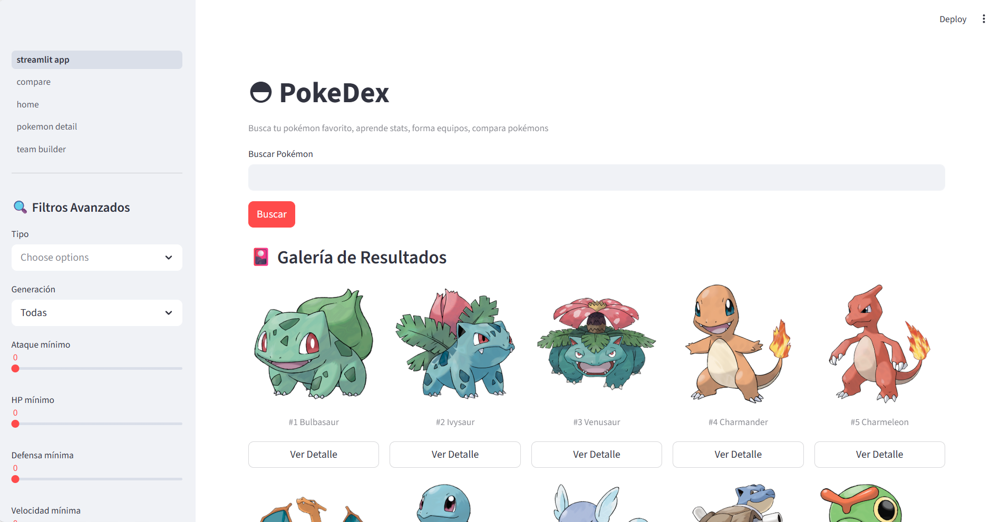
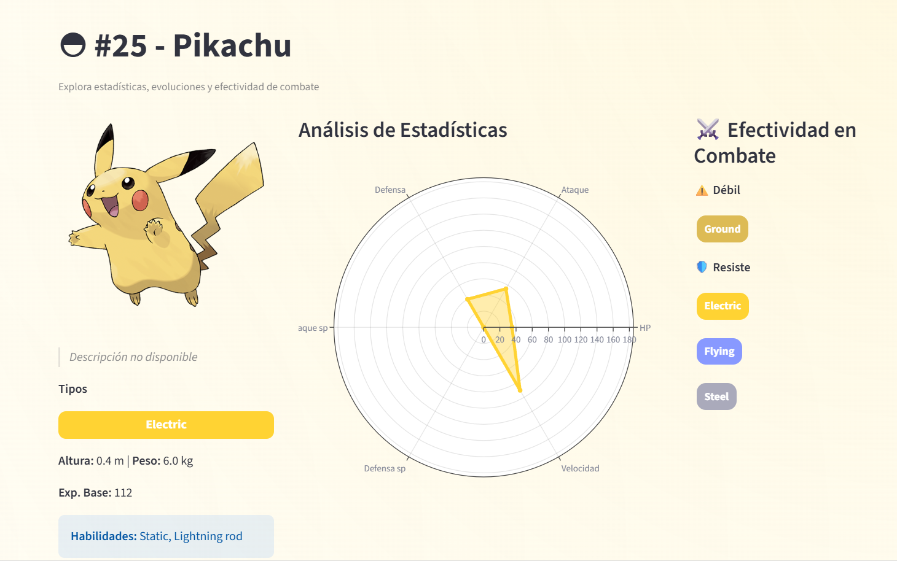
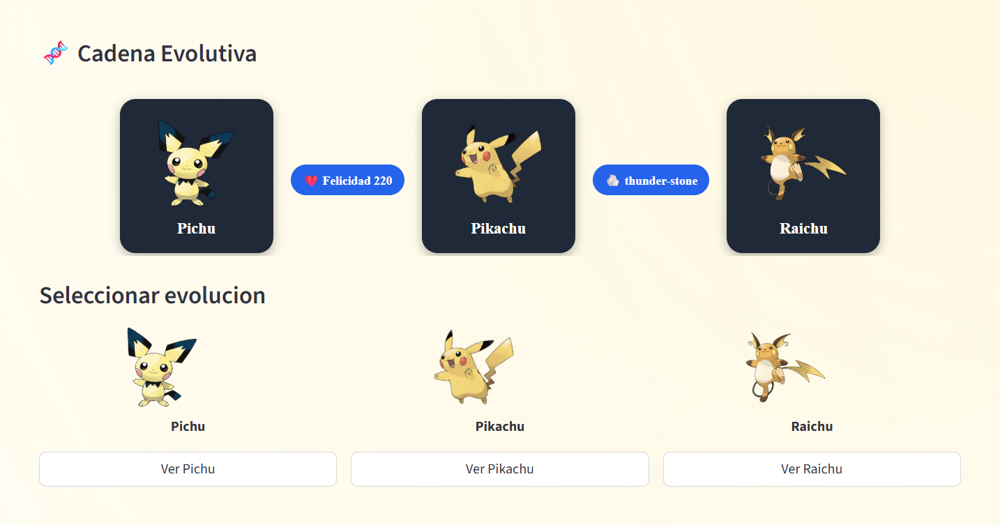
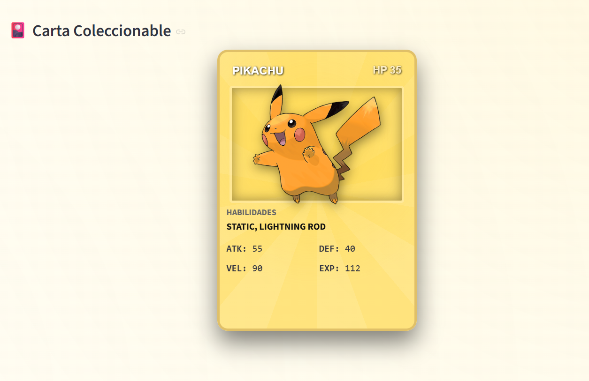

# Pokedex App

## Descripcion
Esta es una app web de tipo Pokedex construida con Streamlit y FastAPI, que permite consultar y explorar todos los Pokemons, ver sus estadisticas, tipos, cadenas evolutivas y su carta coleccionable, usando la PokeAPI.

## Vista principal






## Estructura del proyecto

El proyecto está organizado en dos partes principales:

- `backend/`: API en FastAPI que consume PokeAPI, aplica caché y expone los datos.
- `frontend/streamlit/`: interfaz de usuario con Streamlit que consume el backend.

## Cómo ejecutar el proyecto

```bash
# 1. Clona el repositorio en la rama julian_brito_duran_branch
```bash
git clone --single-branch --branch julian_brito_duran_branch [https://github.com/dariost2003/programming-msmk.git]

# 2. Ir al directorio del proyecto
cd Pokedex

# 3. Crea tu entorno virtual
python -m venv [nombre de tu repositorio, ej: .venv]

# 4. Instalar dependencias en el entorno correcto
cd backend
cd .venv\Scripts\activate #activa el entorno virtual
python -m pip install -r requirements.txt

# 5. Iniciar el backend
cd backend
python -m uvicorn app.main:app --reload

# 6. En otra terminal, iniciar la app Streamlit desde la raíz del proyecto
cd ..
streamlit run frontend/streamlit/streamlit_app.py
```

Cuando el backend y el frontend estén activos, la app Streamlit podrá consultar el API y mostrar los datos del pokémon.

## Arquitectura
Se construyó la aplicación con un arquitectura modular por capas, centrada en backend/frontend, la arquitectura principal consta de:

Pokedex/
      |
      |-Backend/
      |-Frontend/
      |-docs/

Para visualizar la arquitectura al detalle, dirigirse a architecture.md

## Caracteristicas de la app
- Busqueda por nombre o id.
- Visualizacion al detalle de Pokemon.
- Sprite, estadisticas en grafico en radar, interacciones en combate, tipo, texto descriptivo.
- Cadena evolutiva y sus requerimentos.
- Carta Pokemon.

## Tecnologías
- Python 3.11
- Streamlit
- Requests
- PokeAPI

## Contibuciones
Me encantaría tu ayuda para mejorar el código, cualquier pull es bienvenido, para cambios importantes abre un issue por favor.


